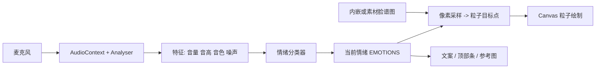

# 秦腔脸谱 · 声音情绪粒子图

> 在线体验：[https://fakerjavascrip.github.io/face/](https://fakerjavascrip.github.io/face/)

单页 Web 应用：通过麦克风采集声音，从音量、音高、音色等特征推断当前「情绪」，驱动数千粒子聚合成对应的秦腔脸谱轮廓，并在界面同步展示参考脸谱图与文案说明。

---

## 一、项目做什么

1. **声音驱动**：用户允许麦克风后，实时分析音频流。
2. **情绪映射**：将分析结果与 7 种预设情绪（热烈、霸气、沉稳、温柔、活泼、狂暴、威严）做匹配；每种情绪对应一张脸谱图与一段文化说明（祝融、雷公、徐彦昭等）。
3. **粒子脸谱**：从脸谱图像中采样有色像素作为粒子目标点，粒子在 Canvas 上受物理规则（seek、阻尼、抖动）牵引，聚合成当前情绪的脸谱形状。
4. **参考图**：右上角「参考脸谱」卡片从 `素材/png/` 加载同名小图，与粒子形态同步切换（淡入淡出）。
5. **手动切换**：顶部胶囊条可点击任意情绪名，不依赖麦克风即可预览脸谱与粒子效果。
6. **辅助功能**：重置按钮；若浏览器支持 Web Speech API，可说「重新开始」类口令触发重置；麦克风异常时有居中提示说明。

---

## 二、目录与文件说明

| 路径 / 文件 | 说明 |
|-------------|------|
| `emotions.html` | **主入口**：内含 HTML 结构、CSS 样式、JavaScript 逻辑；脸谱用于粒子采样的 JPEG 以 **Base64 内嵌**（体积较大），便于 `file://` 下仍能读像素、拼出粒子脸谱。 |
| `素材/` | 原始高清脸谱 PNG（如 `热烈.png` 等），以及可选的 `素材/png/` 小图（供右上角 `` 展示）；若内嵌加载失败会尝试回退到 `素材/` 路径。 |
| `素材/png/*.png` | 与情绪同名的预览图，供参考脸谱卡片使用。 |
| `_convert.ps1`、`_make_embedded.ps1`、`生成单文件版.bat` | （若存在）用于从原图生成压缩图或重新内嵌 Base64 的辅助脚本，非运行必需。 |

---

## 三、如何使用

### 推荐方式

用浏览器直接打开 `emotions.html` 即可体验（粒子采样依赖内嵌图时，**不强制**本地服务器）。

若遇麦克风权限或 `mediaDevices` 不可用：

- 使用 **Chrome / Edge / Firefox** 较新版本；
- 或在本目录执行 `python -m http.server 8000`，再访问 `http://localhost:8000/emotions.html`。

### 操作提示

1. 首次进入等待加载条结束；
2. **点击页面**（任意空白处）触发麦克风授权；
3. 发声后观察底部音量、音高、音色条与当前情绪名；
4. 顶部可点选情绪；右下角可重置。

---

## 四、技术栈说明

本项目为 **零构建、零 npm 依赖** 的静态前端，技术选型如下。

### 4.1 总览

| 层级 | 技术 |
|------|------|
| 页面与样式 | **HTML5**、**CSS3**（Flex、媒体查询、渐变、`backdrop-filter` 等） |
| 逻辑 | **原生 JavaScript（ES6+）**，IIFE 封装，无 TypeScript / 无框架 |
| 图形 | **Canvas 2D API**（双画布：背景 + 粒子），`requestAnimationFrame` 动画循环 |
| 音频 | **Web Audio API**（`AudioContext`、`AnalyserNode`）、**MediaDevices.getUserMedia** |
| 语音（可选） | **Web Speech API**（`SpeechRecognition` / `webkitSpeechRecognition`） |
| 资源 | **Data URL（Base64 JPEG）** + 本地 **PNG** 路径引用 |

### 4.2 各模块对应能力

- **Canvas**：离屏 canvas 绘制缩略脸谱，`getImageData` 提取非背景像素作为粒子目标；主画布清屏、拖尾、画圆点粒子。
- **Web Audio**：`getFloatTimeDomainData` 计算 RMS 音量、过零率；自相关估计基频音高；`getByteFrequencyData` 估计频谱质心作「音色亮度」近似。
- **情绪分类**：在代码中为每种情绪设定 `(vol, pitch, bright, noise)` 特征中心，用加权距离得分，配合衰减投票与最短切换间隔，减少抖动。
- **图片加载**：优先 `EMBEDDED_IMAGES[name]`（data URL）；否则 `素材/文件名.png`。`loadImage` 对非 `data:` 源可设 `crossOrigin`，避免污染画布；**不对** `data:` 设 `crossOrigin`，以免部分浏览器加载失败。
- **参考图**：普通 ``，不经过 canvas 读像素，在 `file://` 下仍可显示（路径需与 HTML 同目录结构）。

### 4.3 明确未使用的技术

- 无 **React / Vue / Svelte** 等 UI 框架  
- 无 **Node.js 后端**、无 **WebSocket**  
- 无 **WebGL / Three.js**  
- 无 **打包工具**（Webpack、Vite 等）  
- 情绪识别为 **规则 + 特征距离**，非云端大模型 API（可自行替换为服务端分类接口，需另起工程）

---

## 五、架构简图（数据流）

---

## 六、扩展与维护建议

- **调整识别敏感度**：修改 `EMOTIONS` 中各情绪的 `vol` / `pitch` / `bright` / `noise` 锚点，或调整 `classifyEmotion` 中的投票阈值与平滑系数。
- **更换脸谱**：替换 `素材/` 与 `素材/png/` 中同名文件，并重新运行内嵌脚本更新 `EMBEDDED_IMAGES`（若保留单文件策略）。
- **接入真实情绪 API**：可在 `classifyEmotion` 中改为 `fetch` 调用后端，将返回标签映射到 `EMOTIONS` 某一项即可（需处理跨域与 HTTPS）。

---

## 七、版权与素材

脸谱图像与文案说明来自项目需求中的秦腔文化设定；使用与传播请遵守原作者或课程要求。

如有问题，可直接编辑 `emotions.html` 内对应注释区块（搜索「脸谱定义」「音频特征」「粒子系统」等分段标题）。
